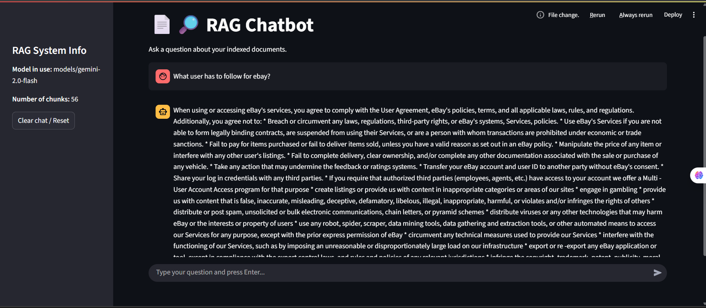
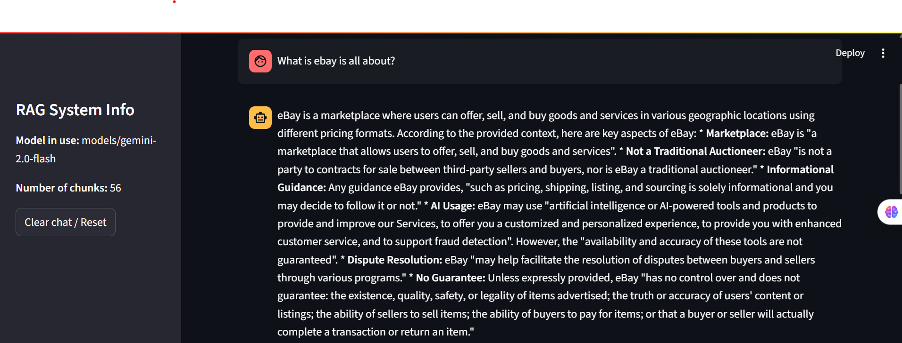
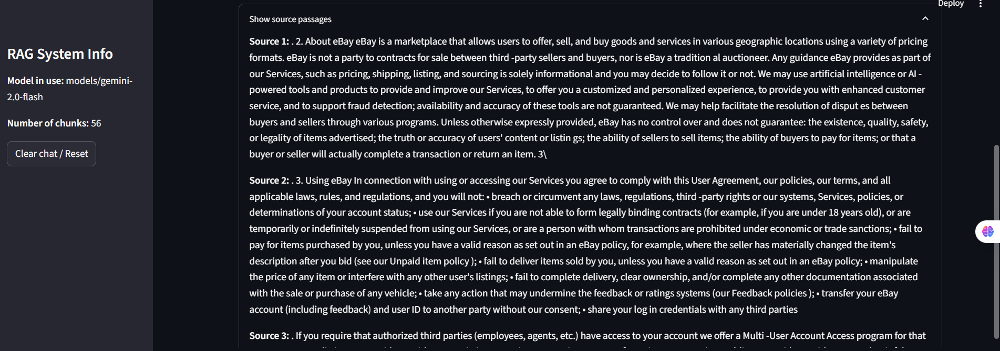

# RAG_documents_training

## Project Overview

This project implements a Retrieval-Augmented Generation (RAG) pipeline for question answering over custom documents. The backend is built in Python and leverages chunking, embedding, vector search, and LLM-based answer generation. A Streamlit frontend provides a chat interface with real-time streaming responses and source document display.

---

## Architecture & Flow

1. **Preprocessing & Chunking**: Documents are split into overlapping chunks using sentence-aware logic.
2. **Embedding**: Each chunk is embedded using a model = SentenceTransformer("all-MiniLM-L6-v2") and stored as a vector.
3. **Vector Database**: ChromaDB is used to store and retrieve chunk embeddings.
4. **Retrieval**: At query time, the top-k most relevant chunks are retrieved from the vector DB.
5. **Prompting & Generation**: Retrieved chunks are formatted into a prompt and sent to a Google Gemini LLM for answer generation.
6. **Frontend**: Streamlit app for user queries, streaming answers, and source display.

---

## Setup & Running the Pipeline

### 1. Preprocessing & Chunking

- Place your document (e.g., `AI Training Document.pdf`) in the `data/` folder.
- Convert PDF to text and save as `processed_data/training.txt` (use your preferred tool).
- Run chunking:
  ```bash
  python src/chunks.py
  ```
  This creates chunk files in the `chunks/` directory.

### 2. Create Embeddings

- Generate embeddings for all chunks:
  ```bash
  python src/embedder.py
  ```
  Embeddings are saved as CSVs in the `embeddings/` directory.

### 3. Build Vector DB

- The first retrieval or embedding step will initialize the ChromaDB vector database in `vectordb/`.

### 4. Run the Chatbot (with Streaming Response)

- Start the Streamlit frontend:
  ```bash
  streamlit run app.py
  ```
- Enter your query in the chat input. The response will stream in real time, and you can expand to see the source passages used.
- The sidebar shows the current LLM model and the number of indexed chunks.
- Use the "Clear chat / Reset" button to start a new conversation.

---

## Model & Embedding Choices

- **Embedding Model**: `all-MiniLM-L6-v2` from SentenceTransformers (fast, high-quality sentence embeddings).
- **LLM**: Google Gemini 2.0 Flash (via LangChain integration).
- **Vector DB**: ChromaDB (persistent, local, fast retrieval).

---

## Screenshots

1. 

2. 

3. 
